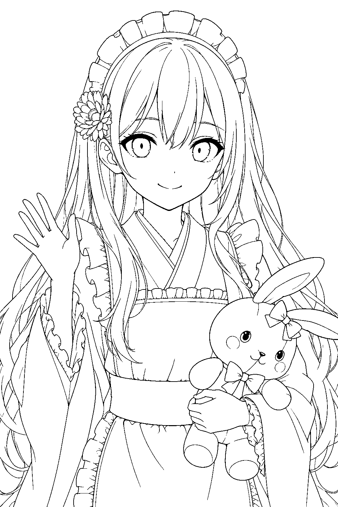

# PsdMaker

イラストを、色・影・線を編集しやすいPSDにするCodex Agent＋ローカルPythonツールです。完成イラストの分解と、指定した線画への着色という2つの機能があります。

Codex Astraが画像を見て髪・肌・衣装・背景などの意味を判断し、Pythonが位置合わせ、領域抽出、マスク・色計算、PSD保存、読み戻し評価を担当します。

## 2つの機能

| 機能 | できること | 入力 | 出力 |
|---|---|---|---|
| 第1機能：イラストを編集しやすいPSDにする | 1枚の完成イラストを、髪・肌・服・線・背景などを編集しやすいレイヤーに分けたPSDにします。 | 完成イラスト。できれば同じ構図の線画も使います。 | レイヤー分けしたPSDと、次の着色に使える色情報 |
| 第2機能：別の線画を同じ配色で着色する | 第1機能で作った色情報を使い、別ポーズなどの線画を同じキャラクターらしい色で着色したPSDにします。 | 着色したい線画＋第1機能で作ったPSDと色情報 | レイヤー分けした着色済みPSD。必要なら影・ハイライトも追加できます。 |

第2機能は、着色したい線画を指定したときだけ動きます。別ポーズの線画を自動で作ったり、頼んでいない着色を始めたりはしません。

PSDの中では、たとえば「服 → 袖 → ベース色・影・ハイライト」のようにレイヤーを整理します。レイヤーはPhotoshopなどで自由に編集できますが、同じ色のレイヤーを変えても他のレイヤーが自動で連動するわけではありません。

Codexは、GPT-6 Astra Light(low) 以上を推奨します。Claudeなど他の生成AIモデルは検証していません。
動作検証は、長辺1280px（または画素数1Mpx）程度のイラストや線画をインプットとして実施しています。大きい画像の場合は時間がかかったり、トークン消費量が飛躍的に増大する可能性があります。

本機能の使い方については、git cloneしてCodexに「このフォルダで何ができる？」のように聞いてみるのが手取り早いかと思います。

## 重要な注意

- **第三者のイラストや、権利・外部AI利用の許諾が不明な画像は入力しないでください。** 入力できるのは、利用者が権利を持つか、権利者から外部AIへの送信・解析・再構成・PSD出力に必要な許諾を得た画像だけです。公開画像、依頼で預かった原稿、二次創作、版権キャラクター、スクリーンショット、人物写真、機密情報なども、入力してよいとは限りません。
- **Codexの利用を前提とします。** 画像と作業指示は、利用中のCodexおよび必要に応じた画像生成機能の提供事業者へ送信されます。国外を含むサーバへの送信、保存、安全確認、人による確認、モデル改善・学習等の扱いが生じる可能性は、利用中のプラン・設定・規約・仕様に依存します。作者はそれらを管理できず、送信後の完全削除も保証できません。機密性または権利関係に懸念のある画像は使用しないでください。
- **出力品質・用途適合性は保証しません。** パーツの欠落や混入、境界・細線・色・透過の不正確さ、PSD編集時の互換性問題などが起こり得ます。公開、納品、印刷その他の利用前に、必ず利用者自身で確認・修正してください。

## 作例

左の画像のような、レイヤー分けされていない完成イラストを第1機能へ渡すと、髪・服・肌・線などを編集しやすく分けたPSDを作れます。

そのPSDと一緒に出力される色情報を保存しておけば、第2機能で中央のような別の線画を着色できます。右は、元のイラストの配色を引き継いで作った着色済みPSDの見た目です。

| 第1機能の入力 | 第2機能の線画 | 第2機能の着色結果 |
|---|---|---|
|  |  |  |

- [第1機能の編集可能PSD](examples/output/output.psd) ／ [配色・意味情報JSON](examples/output/coloring_reference.json)
- [第2機能の線画JPG](examples/coloring/lineart.jpg) ／ [着色PSD](examples/coloring/output.psd)
- [作例の仕様・検証結果・制約](examples/README.md)

第2機能の作例は開発試験用に生成した線画を使い、参照PSDのBase色とAI照明案から着色したものです。JPGのEXIF/XMP・コメント・生成情報は除去しています。細い線の途切れや照明の細部ずれが残り、制作実務にそのまま使える品質を保証するものではありません。

## セットアップ

- Python 3.12以上（プレビューにはTkinterが必要）
- Windows環境（付属BATを使う場合）
- 初回の依存インストールに必要なインターネット接続
- このフォルダを読み書きでき、画像を確認できるCodex環境

リポジトリ直下で実行します。

```powershell
.\setup.bat
```

依存パッケージはプロジェクト内の `.venv` に入ります。ローカルCLIはOpenAI APIキーを要求しません。モデルは利用者のCodex画面で選択します。Codexや任意の画像生成機能の利用条件・料金は利用中のサービスを確認してください。

## 第1機能を使う

`input/` を作り、完成画像と対応する線画を配置します。このフォルダをCodexで開き、次のように依頼します。

```text
AGENTS.mdとdocs/ARTIST_WORKFLOW.mdを読み、
input/reference.pngとinput/lineart.pngからoutput/my_job/output.psdを作成してください。
描画レイヤー数と色統一許容値はお任せします。
位置合わせ、意味分類、編集設定、PSD生成、評価、事後レビューまで進めてください。
```

「描画レイヤー数は100〜180枚、色統一許容値は30」のようにも指定できます。描画枚数はフォルダを含みません。色統一許容値は0〜100で、値を上げるほど同素材の塗り色を揃えやすくします。未指定・お任せの場合は素材数と色のばらつきから計算します。

線画がない場合は、利用中の環境に画像生成機能があれば作成を依頼できます。生成線画の形状差を確認し、原画を変形せず線画側を位置合わせします。

`start_preview.bat` を開くと別ウィンドウでPSD・参照・差分・線画・背景・配色を表示できます。PSDができるまでは待機し、保存後に表示を更新します。起動は任意です。

主な成果物は `output.psd`、`coloring_reference.json`、再合成画像、`analysis.json`、意味計画、比較画像・事後レビュー結果です。`work/my_job/` には領域・マスクと再開用キャッシュを保存します。

## 第2機能を使う

第1機能を終えると、出力先に `output.psd` と `coloring_reference.json` が作られます。この2つは、元の絵のどの部分をどんな色で塗ったかを第2機能へ伝えるためのセットです。削除せず、同じ場所に保管してください。

次に着色したい線画を用意し、このフォルダをCodexで開いて、次のように依頼します。`my_first_job`、ファイル名、出力先は自分のものに置き換えてください。

```text
AGENTS.mdとdocs/COLORING_WORKFLOW.mdを読み、input/new_pose_lineart.pngを着色してください。
第1機能で作ったoutput/my_first_job/output.psdと、その隣のcoloring_reference.jsonを参照してください。
新しいjobはwork/my_new_pose、出力はoutput/my_new_pose/output.psdにしてください。
参照パレットの意味確認、下塗り、PSD生成、事後レビューまで進めてください。
```

まずは「下塗りだけ」と頼んでも構いません。影・ハイライトもほしい場合は、依頼文に追加してください。第2機能では新しい線画の各部分を確認してから着色するため、元の絵の位置をそのままコピーするものではありません。

第1機能で作ったPSDと `coloring_reference.json` があれば、元の `work/` フォルダがなくても着色を続けられます。線画は別ポーズでもかまいませんが、同じキャラクター・衣装を想定したものが扱いやすくなります。

以前に作ったjobへJSONを追加する場合:

```powershell
.\.venv\Scripts\python.exe -m anime_layer_agent export-coloring-reference --job work/source
```

## CLIと作業手順

Codexに作業を依頼して使う場合は、この章は読み飛ばして大丈夫です。ここは、Pythonのコマンドを自分で実行して、処理の準備・確認・PSD作成を進めたい人向けです。

CLIでは、画像と線画の位置合わせ、塗る場所の一覧作成、PSDの組み立て、出力後の確認画像作成などを実行できます。ただし「ここは髪」「ここは服」といった絵の意味を判断して計画へ書き込む作業は別に必要です。コマンドだけを順番に実行しても、確認なしに完成PSDができるわけではありません。

```powershell
.\.venv\Scripts\python.exe -m anime_layer_agent --help
.\.venv\Scripts\python.exe -m anime_layer_agent prepare-coloring --lineart examples/coloring/lineart.jpg --source-reference examples/output/coloring_reference.json --job work/coloring_example --gap-close 5 --min-area 20
```

上の `prepare-coloring` は、線画の中から「塗り分ける候補」を見つけて一覧にする準備コマンドです。第2機能を手動で進める場合は、一覧を確認して計画を作り、`paint-flats`（下塗り）、必要に応じて `prepare-lighting`（影・ハイライトの準備）、`build-colored`（PSD作成）、`post-review` と `finish-review`（出力確認）の順に進めます。元の作業フォルダを参照する場合は、`--source-reference` の代わりに `--source-job work/source` を指定します。

- [Agent共通手順](docs/AGENT_WORKFLOW.md)
- [第1機能：編集優先工程](docs/ARTIST_WORKFLOW.md) ／ [位置合わせ・領域抽出](docs/COMPACT_WORKFLOW.md)
- [第2機能：指定線画への着色](docs/COLORING_WORKFLOW.md) ／ [引き継ぎJSONの仕様](docs/COLORING_REFERENCE.md)
- [事後レビュー](docs/POST_REVIEW_CHECKLIST.md) ／ [仕様](docs/SPEC.md)

## 品質と制約

数値合格だけでは意味分離・境界・色替えの自然さを証明できません。実PSDの色替え、線・背景単独、影・光OFFを確認し、所見と画像根拠を記録します。第1機能は原画との差と編集目標からの読み戻し誤差を分け、第2機能はPythonの着色目標からの読み戻しを評価します。

- 隠れた髪・腕・衣服の描き足し、Live2D用の完全パーツ展開、ベクター線画は対象外です。
- 開いた線、細い模様、厚塗り、複雑な透過、特殊発光などは正しく分離・着色できない場合があります。
- 線画の二値化やJPG圧縮で細線が変わる場合があります。
- Photoshop／CLIP STUDIO PAINT上での互換性・編集品質は別途確認が必要です。付属作例は実アプリ未検証です。

## 公開ファイルとプライバシー

`input/`、`work/`、通常の `output/`、`backup/`、一時ファイル、ジョブ履歴はGitの公開対象外です。`examples/` は `.gitignore` で明示した作例だけを含めます。不要になった旧文書・試作スクリプトはローカルのbackupへ退避しています。実行時にbackupは不要です。

JPGにもメタデータは入るため、拡張子だけでは情報除去になりません。新しい作例を公開する際は画像・PSD・JSONの内容を確認してください。Gitでの除外は、画像確認や生成に使うサービスへ送信されないことを意味しません。

## 開発用検証

```powershell
.\.venv\Scripts\python.exe -m pytest
.\.venv\Scripts\python.exe scripts/verify_compact.py --job work/my_job
.\.venv\Scripts\python.exe scripts/verify_preview.py
```

CLI終了コードは0がコマンド成功、1が入力・実行エラー、2が数値品質・編集読み戻し・指定枚数・レビュー判定の未達です。buildやpost-reviewの成功だけでは視覚確認は完了しません。

## ライセンス

[Unlicense](LICENSE)です。商用・非商用を問わず、利用・改変・再配布できます。付属の文書・作例も、提供者が権利を持つ範囲で同じ条件とします。依存ライブラリはそれぞれのライセンスに従います。

## 注意および免責事項

本リポジトリは個人が公開するオープンソースソフトウェアです。次を了承したうえで利用してください。

- 入力画像および出力PSDの権利は元の権利者に留まり、作者は出力の著作権を主張しません。ただし、出力の利用可能な範囲は、利用者が入力時点で有していた権利を超えません。AI処理を経ても、第三者の著作物の利用が適法になるわけではありません。
- 法令、利用する外部AIサービスの規約、本READMEの注意に反する利用、権利者を偽る行為、サービスの制限回避、過度な自動実行、出力を第三者学習データとして不当に収集・利用する行為は行わないでください。第三者から権利侵害等の主張を受けた場合は、利用者が自己の責任と費用で対応してください。
- 本ソフトウェアは現状有姿で提供されます。適用法令で認められる最大限の範囲で、作者は、特定目的適合性、非侵害、無欠陥、継続提供、外部AIサービスの可用性、出力品質、データの機密性・完全削除を含む一切の保証をしません。入力・出力・公開・販売・外部送信・情報漏えい・学習利用・アカウント停止・第三者からの請求等により生じた損害について、作者は責任を負いません。
- フォーク、再配布、独自ホスティングを行う人は、その環境の運営者です。外部AIとの契約、料金、データ取扱い、入力確認、苦情対応は運営者自身の責任で行ってください。作者はフォーク先での利用に責任を負いません。

この注意および免責事項は予告なく更新されることがあります。最新版は本リポジトリを確認してください。
